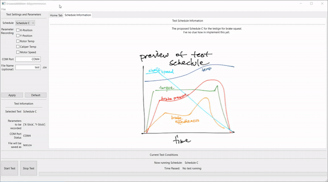

Drake Dyno Software for Data Acquisition
=========================

A python program that's compiled into an .exe (with pyinstaller) to run with a Arduino Uno. <del>Used to be compilable to an .exe but pyinstaller doesn't work with matplotlib. For now, you'll need to run the .py file. </del> Plotting is back on baybey. I'll update the gif later. 

Usage
========

Default is COM3, but you can input whatever port and it'll check it. 
Requires the following packages 
- pyserial 
- wxPython
- numpy (although I might get rid of this dependancy to reduce file size)

I can't upload the executable to Github since it's too big, so it's in MECH4552\Documents\7. Project sections\3. Data Acq\brake_dyno\dist

Notes
=========
Because i keep forgetting; to compile to exe, run Anaconda prompt and use

    pyinstaller --onefile main.py
    
in the directory of main.py

Done 
====================
- Recording functionality with GUI and a button is done and works alright
- live plot in the same window 

To Do
======
- input speeds for constant speed and torque schemes
